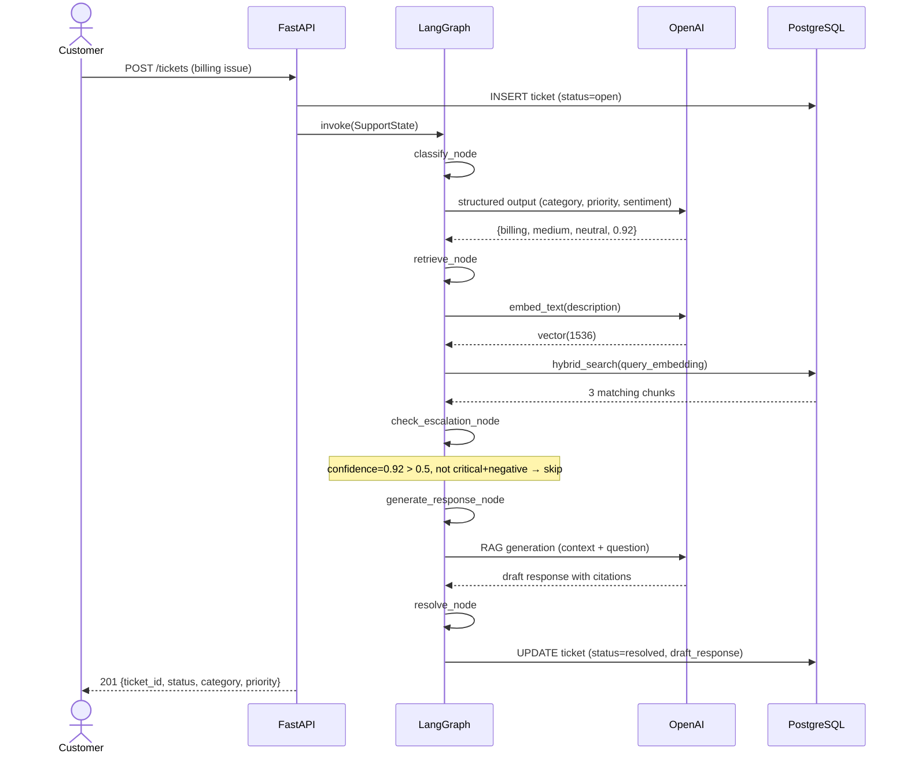
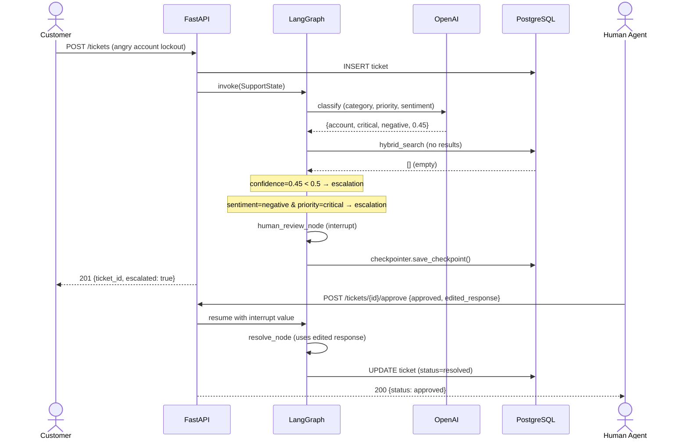
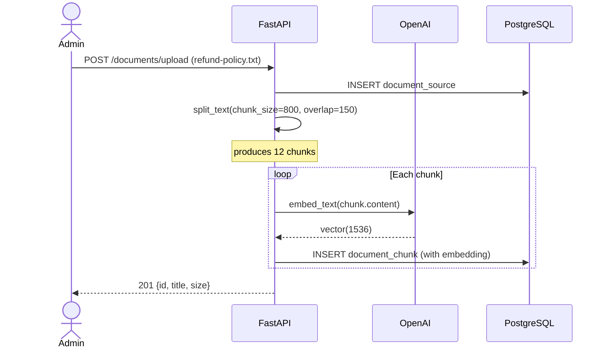
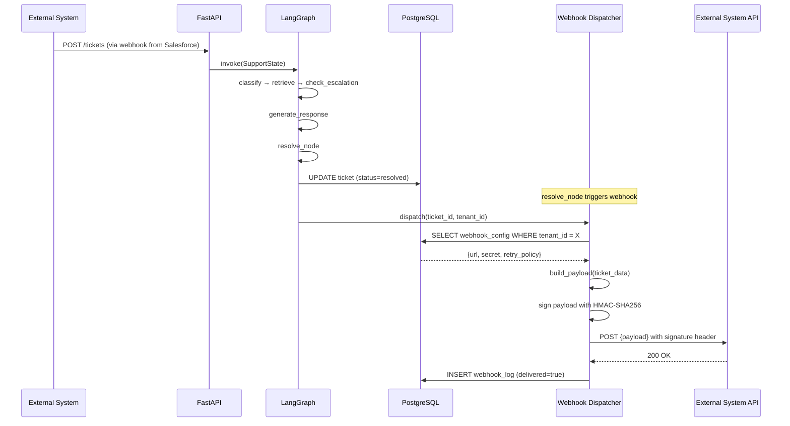
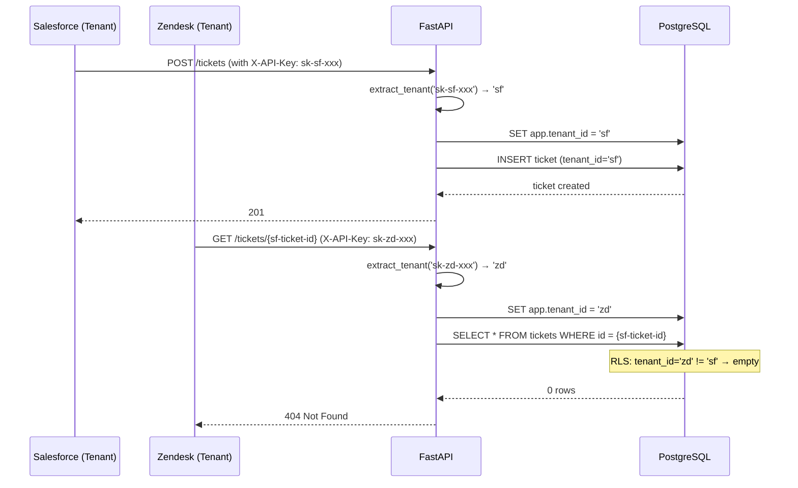

# System Design: Customer Support AI Agent Platform

## 1. System Overview

### High-Level Architecture

```
┌─────────────────────────────────────────────────────────────────────────┐
│                              Client Layer                                │
│  (Web App / Mobile / Salesforce / Zendesk / Intercom / HubSpot)         │
└────────────────────────────┬────────────────────────────────────────────┘
                             │ HTTPS
                             ▼
┌─────────────────────────────────────────────────────────────────────────┐
│                          API Gateway / Ingress                           │
│  (TLS termination, rate limiting, WAF, auth)                             │
└────────────────────────────┬────────────────────────────────────────────┘
                             │
                             ▼
┌─────────────────────────────────────────────────────────────────────────┐
│                         FastAPI Application                              │
│                                                                          │
│  ┌──────────────────────────────────────────────────────────────────┐   │
│  │                       API Endpoints                               │   │
│  │  POST /tickets    GET /tickets/{id}    POST /tickets/{id}/approve  │   │
│  │  POST /chat       POST /documents      GET /documents              │   │
│  └──────────────────────────┬───────────────────────────────────────┘   │
│                             │                                            │
│  ┌──────────────────────────▼───────────────────────────────────────┐   │
│  │                     LangGraph Agent                               │   │
│  │                                                                   │   │
│  │  classify ─► retrieve ─► analyze ─► check_escalation             │   │
│  │                                      │                            │   │
│  │                           ┌──────────┴──────────┐                │   │
│  │                           ▼                     ▼                │   │
│  │                    human_review        generate_response          │   │
│  │                           │                     │                │   │
│  │                           └──────┬──────────────┘                │   │
│  │                                  ▼                               │   │
│  │                             resolve                              │   │
│  └──────────────────────────────────────────────────────────────────┘   │
│                             │                                            │
└─────────────────────────────┼────────────────────────────────────────────┘
                              │
        ┌─────────────────────┼─────────────────────┐
        ▼                     ▼                     ▼
┌───────────────┐    ┌───────────────┐    ┌──────────────────┐
│  PostgreSQL   │    │    OpenAI     │    │  External        │
│  + pgvector   │    │  (API calls)  │    │  Webhooks        │
│               │    │               │    │  (Salesforce,    │
│  • tickets    │    │  • Chat       │    │   Zendesk,       │
│  • chunks     │    │  • Embeddings │    │   Intercom etc.) │
│  • checkpoints│    │  • Structured │    │                  │
└───────────────┘    └───────────────┘    └──────────────────┘
```

### Component Responsibilities

| Component | Role |
|---|---|
| **FastAPI** | HTTP interface, request validation, response serialization, dependency injection |
| **LangGraph Agent** | State machine orchestrating classification → retrieval → response generation |
| **OpenAI / LLM** | NLU: classification, sentiment, summarization, response generation |
| **PostgreSQL + pgvector** | Persistent store: tickets, messages, document chunks with vector embeddings |
| **Human Reviewer** | Approval step via API for escalated tickets |

---

## 2. Scenario A: Happy Path — Automated Resolution

A customer submits a billing ticket. The system resolves it without human intervention.

### Flow

```
Customer                               FastAPI               LangGraph              OpenAI          PostgreSQL
   │                                     │                      │                     │                 │
   │  POST /api/v1/tickets               │                      │                     │                 │
   │  {customer_id, subject, desc}       │                      │                     │                 │
   │────────────────────────────────────►│                      │                     │                 │
   │                                     │ INSERT ticket        │                     │                 │
   │                                     │───────────────────────────────────────────► status=open     │
   │                                     │                      │                     │                 │
   │                                     │ invoke(SupportState) │                     │                 │
   │                                     │─────────────────────►│                     │                 │
   │                                     │                      │                     │                 │
   │                                     │    classify_node     │                     │                 │
   │                                     │    (description)     │────────────────────►│                 │
   │                                     │                      │◄────────────────────│                 │
   │                                     │                      │  {category: billing,│                 │
   │                                     │                      │   priority: medium, │                 │
   │                                     │                      │   sentiment: neut,  │                 │
   │                                     │                      │   confidence: 0.92} │                 │
   │                                     │                      │                     │                 │
   │                                     │    retrieve_node     │                     │                 │
   │                                     │    hybrid_search()   │────────────────────►│                 │
   │                                     │                      │◄────────────────────│                 │
   │                                     │                      │  3 doc chunks       │                 │
   │                                     │                      │                     │                 │
   │                                     │    check_escalation  │                     │                 │
   │                                     │    confidence>0.5,   │                     │                 │
   │                                     │    not crit+neg      │                     │                 │
   │                                     │    → skip human      │                     │                 │
   │                                     │                      │                     │                 │
   │                                     │    generate_response │                     │                 │
   │                                     │    (context + query) │────────────────────►│                 │
   │                                     │                      │◄────────────────────│                 │
   │                                     │                      │  {answer, citations}│                 │
   │                                     │                      │                     │                 │
   │                                     │    resolve_node      │                     │                 │
   │                                     │    UPDATE ticket     │                     │                 │
   │                                     │───────────────────────────────────────────► status=resolved │
   │                                     │                      │                     │                 │
   │  ◄───────────────────────────────────│                      │                     │                 │
   │  201 {id, status, category, ...}    │                      │                     │                 │
```

### Sequence (Mermaid)



### LangGraph State Transitions

```
State at START:
  {ticket_id: "abc-123", customer_id: "cust-456",
   description: "Charged $299 instead of $99", messages: []}

State after classify_node:
  +{category: "billing", priority: "medium", sentiment: "neutral",
    confidence: 0.92, summary: "Customer was overcharged..."}

State after retrieve_node:
  +{retrieved_docs: [
     {content: "Annual plans...", heading: "Refund Policy", score: 0.87},
     {content: "Billing disputes...", heading: "Contact Billing", score: 0.72},
     {content: "Plan changes...", heading: "Upgrade/Downgrade", score: 0.61}
    ]}

State after check_escalation_node:
  +{requires_escalation: false}

State after generate_response_node:
  +{draft_response: "I see the overcharge of $299 instead of $99. I have issued a $200 refund to your account. It will appear within 3-5 business days. [Source: Refund Policy - Annual Plans]"}

State after resolve_node (END):
  +{status: "resolved"}
```

**Time**: ~3s p95

---

## 3. Scenario B: Escalation — Human-in-the-Loop

A frustrated customer reports a critical account lockout. Confidence is low. The system escalates.

### Flow

```
Customer                             FastAPI               LangGraph              OpenAI           PostgreSQL
   │                                   │                      │                     │                  │
   │ POST /api/v1/tickets              │                      │                     │                  │
   │ {angry account lockout desc}      │                      │                     │                  │
   │──────────────────────────────────►│                      │                     │                  │
   │                                   │ INSERT ticket        │                     │                  │
   │                                   │───────────────────────────────────────────► status=open      │
   │                                   │                      │                     │                  │
   │                                   │ invoke()             │                     │                  │
   │                                   │─────────────────────►│                     │                  │
   │                                   │                      │                     │                  │
   │                                   │ classify_node        │                     │                  │
   │                                   │───────────────────────────────────────────►                  │
   │                                   │                      │◄────────────────────│                  │
   │                                   │                      │ {account, critical, │                  │
   │                                   │                      │  negative, 0.45}    │                  │
   │                                   │                      │                     │                  │
   │                                   │ retrieve_node        │                     │                  │
   │                                   │ hybrid_search()      │────────────────────►│                  │
   │                                   │                      │◄────────────────────│                  │
   │                                   │                      │ 0 relevant docs     │                  │
   │                                   │                      │                     │                  │
   │                                   │ check_escalation     │                     │                  │
   │                                   │ negative+critical=T  │                     │                  │
   │                                   │ confidence<0.5=T     │                     │                  │
   │                                   │ → ESCALATE           │                     │                  │
   │                                   │                      │                     │                  │
   │                                   │ human_review_node    │                     │                  │
   │                                   │ interrupt()          │                     │                  │
   │                                   │ State persisted via  │                     │                  │
   │                                   │ PostgresSaver        │────────────────────►                  │
   │                                   │                      │                     │                  │
   │  ◄─────────────────────────────────│                      │                     │                  │
   │  201 {ticket_id, escalated: true} │                      │                     │                  │
   │                                   │                      │                     │                  │
   │  ── time passes ──                │                      │                     │                  │
   │                                   │                      │                     │                  │
Human                                 │                      │                     │                  │
   │ POST /tickets/{id}/approve        │                      │                     │                  │
   │ {approved: true, edited_response} │                      │                     │                  │
   │──────────────────────────────────►│ resume with value    │                     │                  │
   │                                   │─────────────────────►│                     │                  │
   │                                   │                      │ resolve_node        │                  │
   │                                   │                      │ UPDATE ticket       │                  │
   │                                   │───────────────────────────────────────────► status=resolved  │
   │                                   │                      │                     │                  │
   │  ◄─────────────────────────────────│                      │                     │                  │
   │  200 {status: approved}           │                      │                     │                  │
```

### Sequence (Mermaid)



### Interrupt/Resume Detail

The `interrupt()` call in `human_review_node`:

```python
async def human_review_node(state: SupportState) -> dict:
    value = interrupt({
        "draft_response": state["draft_response"],
        "ticket_id": state["ticket_id"],
        "category": state["category"],
        "priority": state["priority"],
        "sentiment": state["sentiment"],
    })
    return {
        "human_approved": value["approved"],
        "human_edited_response": value.get("edited_response"),
    }
```

- `interrupt()` serializes state via `PostgresSaver` into the `checkpoints` and `checkpoint_blobs` tables
- The `POST /tickets/{id}/approve` endpoint resumes the thread with `thread_id` = ticket_id
- LangGraph restores state, injects the interrupt value, and continues to `resolve_node`

**Time**: ~3s for classification + escalation, then indefinite human wait

---

## 4. Scenario C: RAG-Enhanced Agent Chat

A support agent uses the chat endpoint to query the knowledge base while handling a customer.

### Flow

```
Support Agent                         FastAPI               LangGraph              OpenAI           PostgreSQL
   │                                    │                      │                     │                  │
   │ POST /api/v1/chat                  │                      │                     │                  │
   │ {ticket_id, message: "What         │                      │                     │                  │
   │  is refund policy for annual?"}    │                      │                     │                  │
   │───────────────────────────────────►│                      │                     │                  │
   │                                    │ invoke(SupportState) │                     │                  │
   │                                    │ with description=msg │                     │                  │
   │                                    │─────────────────────►│                     │                  │
   │                                    │                      │                     │                  │
   │                                    │ classify_node        │                     │                  │
   │                                    │ (short classification│────────────────────►│                  │
   │                                    │  for context)        │◄────────────────────│                  │
   │                                    │                      │                     │                  │
   │                                    │ retrieve_node        │                     │                  │
   │                                    │ hybrid_search(refund)│────────────────────►│                  │
   │                                    │                      │◄────────────────────│                  │
   │                                    │                      │  5 chunks from      │                  │
   │                                    │                      │  refund_policy.txt  │                  │
   │                                    │                      │                     │                  │
   │                                    │ generate_response    │                     │                  │
   │                                    │───────────────────────────────────────────►                  │
   │                                    │                      │◄────────────────────│                  │
   │                                    │                      │  {answer with       │                  │
   │                                    │                      │   citations}        │                  │
   │                                    │                      │                     │                  │
   │                                    │ resolve_node         │                     │                  │
   │                                    │ (no ticket UPDATE)   │                     │                  │
   │                                    │                      │                     │                  │
   │  ◄──────────────────────────────────│                      │                     │                  │
   │  {response with citations}         │                      │                     │                  │
```

No ticket state is modified here — the endpoint uses the agent as a stateless Q&A tool. This is useful for:
- Support agents looking up policy details mid-conversation
- Generating draft responses for existing tickets
- Exploring the knowledge base without creating a ticket

**Key difference from Scenario A**: The chat endpoint does not persist a new ticket. It creates a transient `SupportState`, runs the agent, and returns only the draft response.

**Time**: ~2s p95 (no DB writes, lighter state)

---

## 5. Scenario D: Document Ingestion for RAG

A knowledge base administrator uploads support documentation to power the RAG pipeline.

### Flow

```
Admin                                 FastAPI                          OpenAI               PostgreSQL
   │                                    │                                │                      │
   │ POST /api/v1/documents/upload      │                                │                      │
   │ (multipart file: refund-policy.txt)│                                │                      │
   │───────────────────────────────────►│                                │                      │
   │                                    │ INSERT document_sources        │                      │
   │                                    │───────────────────────────────────────────────────────► │
   │                                    │                                │                      │
   │                                    │ Text splitter:                 │                      │
   │                                    │ RecursiveCharacterTextSplitter │                      │
   │                                    │ chunk_size=800, overlap=150    │                      │
   │                                    │ → 12 chunks                   │                      │
   │                                    │                                │                      │
   │                                    │ FOR EACH chunk:                │                      │
   │                                    │ embed_text(chunk.content)      │                      │
   │                                    │───────────────────────────────►│                      │
   │                                    │◄───────────────────────────────│                      │
   │                                    │  vector(1536)                  │                      │
   │                                    │                                │                      │
   │                                    │ INSERT document_chunks         │                      │
   │                                    │ (source_id, chunk_index,       │                      │
   │                                    │  content, heading, embedding)  │                      │
   │                                    │───────────────────────────────────────────────────────► │
   │                                    │                                │                      │
   │  ◄──────────────────────────────────│                                │                      │
   │  201 {id, title, size}            │                                │                      │
```

### Sequence (Mermaid)



### Chunking Strategy

```
Raw text:
┌─────────────────────────────────────────────────────────────────────┐
│  Refund Policy                                                      │
│                                                                      │
│  Annual Plans                                                        │
│  Customers on annual plans may request a refund within 30 days...    │
│                                                                      │
│  Monthly Plans                                                       │
│  Monthly subscriptions can be cancelled anytime...                   │
│                                                                      │
│  Processing Time                                                     │
│  Refunds typically take 5-10 business days...                        │
└─────────────────────────────────────────────────────────────────────┘

Chunked (RecursiveCharacterTextSplitter, 800/150):
┌──────────────────────┐  ┌──────────────────────┐  ┌──────────────────┐
│ Refund Policy        │  │ Annual Plans          │  │ Processing Time  │
│                      │  │ Customers on annual   │  │ Refunds typically│
│ Annual Plans         │  │ plans may request a   │  │ take 5-10...     │
│ Customers on annual  │  │ refund within 30...   │  │                  │
│ plans may request... │  │                       │  │                  │
│                      │  │ Monthly Plans         │  │                  │
│                      │  │ Monthly subscriptions │  │                  │
│                      │  │ can be cancelled...   │  │                  │
└──────────────────────┘  └──────────────────────┘  └──────────────────┘
   chunk_index=0             chunk_index=1              chunk_index=2
```

Each chunk is:
1. Embedded via `text-embedding-3-small` → 1536-dim vector
2. Stored in `document_chunks` with `source_id`, `chunk_index`, `heading`
3. Indexed via HNSW for fast approximate nearest neighbor search

**Time**: ~1s per chunk (embedding ~200ms, DB insert ~50ms)

---

## 6. Scenario E: Webhook Callback — External System Integration

After the agent resolves a ticket, the platform pushes the result back to the originating external system (Salesforce, Zendesk, Intercom, or HubSpot).

### Architecture

```
┌──────────────┐    ┌────────────────┐    ┌──────────────────────────────┐
│  Salesforce  │    │  Zendesk       │    │  Intercom / HubSpot          │
│              │    │                │    │                              │
│  POST /ticket│    │  POST /tickets │    │  API endpoints               │
│  to support  │    │  to support    │    │                              │
└──────┬───────┘    └───────┬────────┘    └──────────────┬───────────────┘
       │                    │                             │
       │         ┌──────────▼─────────────────────────────┘
       │         │
       │    ┌────▼─────────────────────────────────────────┐
       │    │          API Gateway / Ingress                │
       │    │  (identifies tenant via API key or webhook    │
       │    │   signature)                                  │
       │    └──────────────────────┬───────────────────────┘
       │                           │
       │    ┌──────────────────────▼───────────────────────┐
       │    │         FastAPI + LangGraph Agent             │
       │    │  ┌──────────────────────────────────────┐    │
       │    │  │  ... resolve_node                     │    │
       │    │  │  → status = resolved                  │    │
       │    │  │  → trigger webhook                    │    │
       │    │  └──────────────────┬───────────────────┘    │
       │    └─────────────────────┼────────────────────────┘
       │                          │
       │    ┌─────────────────────▼────────────────────────┐
       │    │        Webhook Dispatcher                    │
       │    │                                              │
       │    │  1. Look up tenant webhook config            │
       │    │     (url, secret, retry policy)               │
       │    │  2. Build payload:                           │
       │    │     {ticket_id, status, category,            │
       │    │      priority, sentiment, response,          │
       │    │      citations}                              │
       │    │  3. POST with HMAC signature                 │
       │    │  4. Log delivery to webhook_log table        │
       │    │  5. Retry 3x with exponential backoff        │
       │    └─────────────────────┬────────────────────────┘
       │                          │
       └──────────────────────────┼────────────────────────────┘
                                  │
              ┌───────────────────┴───────────────────┐
              │                                       │
    ┌─────────▼─────────┐              ┌──────────────▼──────────┐
    │  Salesforce API    │              │  Zendesk API            │
    │  POST /services/   │              │  POST /api/v2/tickets/  │
    │  data/v57.0/sobj…  │              │  {comment: {body: ...}} │
    └───────────────────┘              └─────────────────────────┘
```

### Sequence (Mermaid)



### Webhook Payload Schema

```json
{
  "event": "ticket.resolved",
  "timestamp": "2026-05-30T12:00:00Z",
  "ticket": {
    "id": "abc-123...",
    "external_id": "sf-98765",
    "customer_id": "cust-456",
    "category": "billing",
    "priority": "medium",
    "sentiment": "neutral",
    "summary": "Customer was overcharged $299 instead of $99",
    "status": "resolved",
    "response": "I see the overcharge. I have issued a $200 refund.",
    "citations": [
      {"source": "refund-policy.txt", "heading": "Annual Plans"}
    ]
  }
}
```

### Retry Policy

| Attempt | Delay | Notes |
|---|---|---|
| 1st | 0s | Immediate delivery |
| 2nd | 10s | First retry |
| 3rd | 60s | Second retry |
| Final | — | Log failure, flag for manual inspection |

### Tenant Configuration

```
webhook_configs table:
┌─────────────────────────────────────────────────────────┐
│ tenant_id  │ platform   │ webhook_url              │ secret  │
├─────────────────────────────────────────────────────────┤
│ tenant_sf  │ Salesforce │ https://sf.salesforce.com/... │ hmac1   │
│ tenant_zd  │ Zendesk    │ https://zendesk.com/...       │ hmac2   │
│ tenant_ic  │ Intercom   │ https://api.intercom.io/...   │ hmac3   │
│ tenant_hs  │ HubSpot    │ https://api.hubapi.com/...    │ hmac4   │
└─────────────────────────────────────────────────────────┘
```

### Handling Webhook Failures

```python
async def dispatch_webhook(ticket_id: str, tenant_id: str):
    config = await get_webhook_config(tenant_id)
    payload = build_payload(ticket_id)
    signature = hmac.new(
        config.secret, json.dumps(payload), hashlib.sha256
    ).hexdigest()

    for attempt in range(3):
        try:
            async with httpx.AsyncClient() as client:
                resp = await client.post(
                    config.webhook_url,
                    json=payload,
                    headers={"X-Signature": signature},
                    timeout=10.0,
                )
            if resp.status_code == 200:
                await log_delivery(ticket_id, attempt + 1, True)
                return
        except (httpx.TimeoutException, httpx.RequestError) as e:
            await log_delivery(ticket_id, attempt + 1, False, str(e))
            if attempt < 2:
                await asyncio.sleep(10 ** attempt * 10)
    await flag_failed_webhook(ticket_id)
```

**Time**: ~500ms additional on top of agent runtime (assuming successful delivery)

---

## 7. Scenario F: Multi-Tenant Isolation

Support teams from different companies (Salesforce, Zendesk, Intercom, HubSpot) use the same platform. Their data must be strictly isolated.

### Isolation Model

```
┌──────────────────────────────────────────────────────────┐
│                   Shared Infrastructure                    │
│                                                            │
│  ┌──────────────┐  ┌──────────────┐  ┌──────────────┐    │
│  │  Tenant: SF   │  │  Tenant: ZD  │  │  Tenant: IC  │    │
│  │  (Salesforce) │  │  (Zendesk)   │  │  (Intercom)  │    │
│  └──────┬───────┘  └──────┬───────┘  └──────┬───────┘    │
│         │                 │                  │            │
│         └────────┬────────┴────────┬─────────┘            │
│                  │                 │                      │
│         ┌────────▼─────────────────▼────────┐             │
│         │     PostgreSQL (shared instance)   │             │
│         │                                    │             │
│         │  tickets:    tenant_id filter      │             │
│         │  chunks:     tenant_id filter      │             │
│         │  webhooks:   tenant_id filter      │             │
│         │  checkpoints: tenant_id filter     │             │
│         └────────────────────────────────────┘             │
│                                                            │
│  OR (future):                                              │
│  ┌────────────┐  ┌────────────┐  ┌────────────┐          │
│  │  DB per    │  │  DB per    │  │  DB per    │          │
│  │  tenant    │  │  tenant    │  │  tenant    │          │
│  └────────────┘  └────────────┘  └────────────┘          │
└──────────────────────────────────────────────────────────┘
```

### Approach: Row-Level Security (Recommended)

```sql
ALTER TABLE tickets ADD COLUMN tenant_id TEXT NOT NULL;
ALTER TABLE document_sources ADD COLUMN tenant_id TEXT NOT NULL;
ALTER TABLE document_chunks ADD COLUMN tenant_id TEXT NOT NULL;

ALTER TABLE tickets ENABLE ROW LEVEL SECURITY;
ALTER TABLE document_sources ENABLE ROW LEVEL SECURITY;
ALTER TABLE document_chunks ENABLE ROW LEVEL SECURITY;

CREATE POLICY tenant_isolation ON tickets
    FOR ALL USING (tenant_id = current_setting('app.tenant_id'));

CREATE POLICY tenant_isolation ON document_sources
    FOR ALL USING (tenant_id = current_setting('app.tenant_id'));

CREATE POLICY tenant_isolation ON document_chunks
    FOR ALL USING (tenant_id = current_setting('app.tenant_id'));
```

### Flow

```
┌──────────────┐               ┌──────────────────────┐               ┌──────────────┐
│  Tenant: SF  │               │      FastAPI          │               │  PostgreSQL   │
│  (Salesforce)│               │                        │               │               │
│              │               │ 1. Authenticate        │               │               │
│  API Key:    │               │    Extract tenant_id   │               │               │
│  sk-sf-xxx   │               │    from API key        │               │               │
│              │               │                        │               │               │
│  POST /ticket│               │ 2. Set session tenant  │               │               │
│─────────────►│               │    SET app.tenant_id   │──────────────►│               │
│              │               │    = 'sf'              │               │               │
│              │               │                        │               │               │
│              │               │ 3. All queries         │               │               │
│              │               │    automatically       │               │  RLS filter:  │
│              │               │    filtered by RLS     │──────────────►│  tenant_id    │
│              │               │                        │               │  = 'sf'       │
│              │               │ 4. Tenant B queries    │               │               │
│              │               │    a different ticket  │               │               │
│              │               │    → RLS blocks it     │               │               │
│              │               │    (empty result)      │──────────────►│  0 rows       │
│              │               │                        │               │               │
│  ◄───────────│               │                        │               │               │
│  200 OK      │               │                        │               │               │
```

### Sequence (Mermaid)



### Multi-Tenant RAG Isolation

Vector search queries must also scope to the tenant's documents:

```python
async def hybrid_search(
    db: AsyncSession,
    query: str,
    tenant_id: str,
    top_k: int = 8,
) -> list[dict]:
    query_embedding = embed_text(query)

    sql = text("""
        WITH vector_results AS (
            SELECT
                dc.id, dc.content, dc.source_id, dc.heading,
                ds.title AS source_title,
                1 - (dc.embedding <=> :vec::vector) AS vector_score,
                ts_rank(to_tsvector('english', dc.content),
                        plainto_tsquery('english', :query)) AS text_score
            FROM document_chunks dc
            JOIN document_sources ds ON ds.id = dc.source_id
            WHERE dc.tenant_id = :tenant_id
            ORDER BY vector_score DESC
            LIMIT :top_k * 2
        )
        SELECT *, (0.7 * vector_score + 0.3 * text_score) AS combined_score
        FROM vector_results
        ORDER BY combined_score DESC
        LIMIT :top_k
    """)

    result = await db.execute(sql, {
        "vec": str(query_embedding),
        "query": query,
        "tenant_id": tenant_id,
        "top_k": top_k,
    })
    ...
```

### Comparison: Shared Table vs Separate Database

| Aspect | Shared Table (RLS) | Separate Database per Tenant |
|---|---|---|
| **Complexity** | Low (one schema) | High (N schemas, connection routing) |
| **Isolation** | Logical (RLS) | Physical (separate instance) |
| **Migration** | One migration | N migrations |
| **Backup** | Single backup | Per-tenant backup |
| **Cross-tenant queries** | Possible (admin) | Impossible |
| **Scaling** | Single DB size limit | Independent scaling |
| **pgvector index** | One index (filters by tenant) | Per-tenant index |
| **Recommended for** | Early stage, <50 tenants | Enterprise, regulated data |

---

## 8. Data Flow Diagrams

### 8a. Request Lifecycle

```
┌──────────┐     ┌──────────┐     ┌──────────┐     ┌──────────┐     ┌──────────┐
│  Client  │────►│  Uvicorn │────►│  FastAPI │────►│  Router  │────►│ Endpoint │
│  (HTTP)  │     │  (ASGI)  │     │  (App)   │     │  (/v1)   │     │  Handler │
└──────────┘     └──────────┘     └──────────┘     └──────────┘     └────┬─────┘
                                                                         │
                                                               ┌─────────▼──────┐
                                                               │  Dependency    │
                                                               │  Injection     │
                                                               │  (DB session)  │
                                                               └─────────┬──────┘
                                                                         │
                                                    ┌────────────────────▼────────────┐
                                                    │  1. Validate request schema     │
                                                    │  2. Insert ticket into DB       │
                                                    │  3. Create SupportState         │
                                                    │  4. Invoke LangGraph agent      │
                                                    │  5. Read result state           │
                                                    │  6. Serialize response          │
                                                    └────────────────────┬────────────┘
                                                                         │
                                                    ┌────────────────────▼────────────┐
                                                    │        JSON Response            │
                                                    │        → Client                │
                                                    └─────────────────────────────────┘
```

### 8b. State Machine (LangGraph)

```
                                                    ┌─────────────┐
                                                    │   START     │
                                                    │             │
                                                    │ ticket_id   │
                                                    │ customer_id │
                                                    │ description │
                                                    │ messages:[] │
                                                    └──────┬──────┘
                                                           │
                                                    ┌──────▼──────┐
                                                    │  classify   │
                                                    │             │
                                                    │ → category  │
                                                    │ → priority  │
                                                    │ → sentiment │
                                                    │ → confidence│
                                                    │ → summary   │
                                                    └──────┬──────┘
                                                           │
                                                    ┌──────▼──────┐
                                                    │  retrieve   │
                                                    │             │
                                                    │ → retrieved │
                                                    │   _docs[]   │
                                                    └──────┬──────┘
                                                           │
                                                    ┌──────▼──────┐
                                                    │  analyze    │
                                                    │             │
                                                    │ → has_      │
                                                    │   relevant  │
                                                    │   _docs     │
                                                    └──────┬──────┘
                                                           │
                                                    ┌──────▼──────────┐
                                                    │ check_escalation│
                                                    │                 │
                                                    │ → requires_     │
                                                    │   escalation    │
                                                    └──┬──────────┬──┘
                                                       │          │
                                                  false│          │true
                                                       │          │
                                          ┌────────────▼──┐  ┌───▼──────────────┐
                                          │ generate_     │  │ human_review     │
                                          │ response      │  │                  │
                                          │               │  │ → human_approved │
                                          │ → draft_      │  │ → human_edited_  │
                                          │   response    │  │   response       │
                                          └────────┬──────┘  └───┬──────────────┘
                                                   │              │
                                                   └──────┬───────┘
                                                          │
                                                    ┌─────▼──────┐
                                                    │  resolve   │
                                                    │            │
                                                    │ → status:  │
                                                    │   resolved │
                                                    │ → END      │
                                                    └────────────┘
```

---

## 9. Key Design Decisions & Tradeoffs

| Decision | Alternatives Considered | Why Chosen |
|---|---|---|
| **LangGraph over custom workflow** | Airflow, Temporal, Prefect, manual state machine | Built-in `interrupt()` for human-in-the-loop, `PostgresSaver` for checkpointing, `Send()` API for parallel fan-out, graph visualization |
| **pgvector over Pinecone/Weaviate** | Pinecone, Weaviate, Qdrant, Milvus | Single PostgreSQL instance — no new infrastructure, ACID compliance, transactional consistency with ticket data, zero network latency between DB and vector store |
| **Async SQLAlchemy over sync** | Sync SQLAlchemy with thread pool | Native async fits FastAPI's ASGI event loop, higher throughput under concurrent load, no thread pool overhead |
| **gpt-4o-mini over gpt-4o** | gpt-4o, gpt-4-turbo, Claude 3.5 | 10x cheaper ($0.15/M vs $2.50/M input), comparable accuracy for classification tasks, configurable per environment |
| **Hybrid search over pure vector** | Pure cosine similarity, pure BM25 | BM25 catches keyword matches that embeddings miss (e.g., exact policy IDs), 0.7/0.3 weighting is tunable per domain |
| **Structured Outputs over JSON mode** | JSON mode, function calling, raw text parsing | Guaranteed schema adherence (CFG engine), automatic Pydantic parsing, refusal detection |
| **HNSW over IVFFlat** | IVFFlat | Faster queries at high recall (HNSW is O(log n) vs IVFFlat's O(n)), no index rebuild needed after inserts |
| **PostgresSaver over MemorySaver** | MemorySaver, RedisSaver, SQLiteSaver | Survives process restarts, enables resume from interrupt, same DB as operational data → consistent backups |
| **interrupt() over webhook polling** | Separate approval queue with polling | LangGraph natively pauses execution — no polling, no race conditions, state is exactly preserved at the point of interruption |

---

## 10. Scaling Characteristics

### Horizontal Scaling (API Layer)

```
                     ┌──────────────┐
                     │  Ingress     │
                     │  (ALB/NGINX) │
                     └──────┬───────┘
                            │
            ┌───────────────┼───────────────┐
            │               │               │
      ┌─────▼──────┐ ┌─────▼──────┐ ┌─────▼──────┐
      │  Pod 1     │ │  Pod 2     │ │  Pod N     │
      │  FastAPI   │ │  FastAPI   │ │  FastAPI   │
      │  LangGraph │ │  LangGraph │ │  LangGraph │
      └─────┬──────┘ └─────┬──────┘ └─────┬──────┘
            │               │               │
            └───────────────┼───────────────┘
                            │
                    ┌───────▼───────┐
                    │  PostgreSQL   │
                    │  + pgvector   │
                    │  (StatefulSet)│
                    └───────────────┘
```

- **Stateless**: API pods have no local state — LangGraph checkpoints are in PostgreSQL
- **HPA**: scale 2–10 pods at 70% CPU utilization
- **Max concurrency**: ~1600 concurrent requests (10 pods × ~165 per uvicorn worker)

### Vertical Scaling (Database)

| Resource | Development | Production |
|---|---|---|
| **Storage** | 20Gi | 100Gi+ (depends on doc volume) |
| **Memory** | 2Gi | 8Gi (HNSW `ef_search` benefits from RAM) |
| **CPU** | 1 core | 4 cores |
| **Connection pool** | 20 (asyncpg) | 100 + PgBouncer |

### Throughput Estimates

| Component | Throughput | Bottleneck |
|---|---|---|
| **Classification** | ~120 RPM (gpt-4o-mini, tier 1) | OpenAI rate limit |
| **Embeddings** | ~2500 RPM (text-embedding-3-small, tier 1) | OpenAI rate limit |
| **pgvector HNSW** | ~5000 QPS (single node, 100K vectors) | CPU/memory |
| **Response generation** | ~60 RPM (gpt-4o-mini, tier 1) | OpenAI rate limit |
| **Webhook delivery** | ~500 RPM | Network + target API |

### Latency Budget

```
Total P95: ~3000ms (automated) / ~5000ms (escalated)

┌──────────────────────────────────────────────────────────────────────┐
│ classify (500ms)    retrieve (300ms)    check (0ms)    gen (2000ms)  │
├────────────────────┼────────────────────┼────────────┼───────────────┤
│ OpenAI struct out  │ embed(200) +       │ rule-based │ OpenAI RAG    │
│ (gpt-4o-mini)      │ search(100)        │ (no LLM)   │ (gpt-4o-mini) │
│                    │                    │            │               │
│         ~500ms     │      ~300ms        │   ~0ms     │   ~2000ms     │
└────────────────────┴────────────────────┴────────────┴───────────────┘
                                    │
                              Total: ~2800ms + network ~200ms = ~3000ms
```

---

## 11. Failure Scenarios

| Failure | Impact | Detection | Mitigation |
|---|---|---|---|
| **OpenAI API down** | Classification and RAG generation fail | HTTP 500 from API, `openai.APIError` exception | Retry with exponential backoff (3 attempts), fall back to rule-based classification, queue for reprocessing |
| **OpenAI rate limited** | Slower processing, failed requests | `openai.RateLimitError` (HTTP 429) | Token bucket rate limiter per tier, queuing with Redis, automatic retry with `Retry-After` header |
| **pgvector index miss** | Low-quality RAG results | Low combined scores in results | BM25 full-text fallback, escalate to human if confidence < 0.5 |
| **DB connection exhaustion** | All API requests fail | `sqlalchemy.exc.TimeoutError`, connection pool full | PgBouncer as connection proxy, pool_size = 20 per pod, HPA scales on connection count |
| **LangGraph checkpoint failure** | In-flight ticket state lost | `langgraph.checkpoint.Error` during save | Checkpointer uses same PostgreSQL — transaction rollback preserves consistency |
| **Webhook delivery failure** | External system not updated | HTTP non-200 or timeout | 3 retries with exponential backoff (10s, 60s, 120s), logged to `webhook_logs` table, flagged for manual retry |
| **File upload too large** | Document ingestion fails | HTTP 413 | Limit to 10MB via middleware, chunk before embedding, reject oversized files early |
| **Memory exhaustion** | Pod OOM killed | Kubernetes OOMKill | Resource limits (512Mi request / 1Gi limit), streaming for large documents |

```python
async def safe_openai_call(func, *args, retries=3, **kwargs):
    last_error = None
    for attempt in range(retries):
        try:
            return await func(*args, **kwargs)
        except openai.APIError as e:
            last_error = e
            if attempt < retries - 1:
                wait = 2 ** attempt * 5
                await asyncio.sleep(wait)
            else:
                raise
    raise last_error
```

---

## 12. Security Boundaries

```
┌─────────────────────────────────────────────────────────────────────┐
│  Internet / External Network                                         │
│                                                                      │
│  ┌─────────────────────────────────────────────────────────────┐    │
│  │  DMZ                                                         │    │
│  │  ┌──────────────┐   ┌──────────────────┐   ┌─────────────┐  │    │
│  │  │  TLS (HTTPS) │──►│  Rate Limiter    │──►│  WAF        │  │    │
│  │  │  (AWS ALB /  │   │  (nginx/         │   │  (Cloudflare│  │    │
│  │  │   nginx)     │   │   envoy)         │   │   / AWS WAF)│  │    │
│  │  └──────────────┘   └──────────────────┘   └─────────────┘  │    │
│  └─────────────────────────────────────────────────────────────┘    │
│                              │                                       │
│  ┌──────────────────────────▼────────────────────────────────────┐  │
│  │  Private Network (K8s Cluster)                                 │  │
│  │                                                                 │  │
│  │  ┌─────────────────────────────────────────────────────────┐  │  │
│  │  │  FastAPI Pod (authenticated via API key)                 │  │  │
│  │  │  • Input validation (Pydantic schemas)                   │  │  │
│  │  │  • SQL injection prevention (parameterized queries)      │  │  │
│  │  │  • LLM prompt injection monitoring (future)              │  │  │
│  │  └──────────────────────┬──────────────────────────────────┘  │  │
│  │                         │                                       │  │
│  │  ┌──────────────────────▼──────────────────────────────────┐  │  │
│  │  │  PostgreSQL (encrypted at rest + in transit)             │  │  │
│  │  │  • Secrets: DB_PASSWORD in K8s Secret                   │  │  │
│  │  │  • RLS for multi-tenant isolation                       │  │  │
│  │  │  • No direct external access (cluster-internal only)    │  │  │
│  │  └─────────────────────────────────────────────────────────┘  │  │
│  │                                                                 │  │
│  │  ┌─────────────────────────────────────────────────────────┐  │  │
│  │  │  OpenAI API (outbound to *.openai.com)                   │  │  │
│  │  │  • API key in K8s Secret (never in code or logs)        │  │  │
│  │  │  • No PII in prompts where possible                     │  │  │
│  │  │  • Token usage tracked per tenant                       │  │  │
│  │  └─────────────────────────────────────────────────────────┘  │  │
│  └─────────────────────────────────────────────────────────────────┘  │
└─────────────────────────────────────────────────────────────────────────┘
```

### Security Controls

| Layer | Control | Implementation |
|---|---|---|
| **Transport** | TLS 1.3 | Ingress terminates HTTPS (AWS ALB / nginx) |
| **Authentication** | API key | `X-API-Key` header → `identify_tenant()` dependency |
| **Authorization** | Tenant isolation | Row-Level Security (RLS) on all tables |
| **Input validation** | Pydantic schemas | Every endpoint validates with Pydantic, rejects malformed input |
| **SQL injection** | Parameterized queries | SQLAlchemy ORM + `text()` with bind parameters |
| **Secrets** | K8s Secrets | Base64-encoded, never in code, per-environment |
| **Rate limiting** | Per-tenant token bucket | Redis-backed, 100 req/min per tenant (configurable) |
| **Audit** | Webhook delivery logs | All outbound webhook attempts logged with timestamps and status |
| **LLM safety** | Prompt template restrictions | System prompts define strict boundaries, no raw user input in system prompt |

---

## 13. Monitoring & Observability

### Key Metrics

| Metric | Where | Alert Threshold |
|---|---|---|
| `classification_latency_ms` | OpenAI API call duration | > 2000ms p99 |
| `retrieval_latency_ms` | pgvector query duration | > 500ms p99 |
| `generation_latency_ms` | OpenAI RAG call duration | > 5000ms p99 |
| `escalation_rate` | % of tickets requiring human review | > 20% |
| `auto_resolution_rate` | % of tickets resolved without human | < 60% |
| `openai_token_count` | Total tokens consumed (per tenant) | Budget threshold |
| `webhook_delivery_failures` | Failed outbound webhooks | > 0 in 5 minutes |
| `db_connection_pool_usage` | PostgreSQL connections | > 80% of pool |

### Audit Trail

All significant events are logged:

```
ticket.created     → {ticket_id, customer_id, timestamp}
ticket.classified  → {ticket_id, category, priority, sentiment, confidence}
ticket.escalated   → {ticket_id, reason}
ticket.resolved    → {ticket_id, auto_resolved: bool}
webhook.sent       → {ticket_id, tenant_id, url, status, attempt}
```

---

## 14. Future Considerations

| Feature | Why | Complexity |
|---|---|---|
| **Streaming responses** | `POST /chat/stream` with SSE for real-time token-by-token output | Medium — LangGraph `astream_events` |
| **Multi-agent routing** | Specialized sub-agents for billing, technical, account | Medium — LangGraph `Send()` API for fan-out |
| **Conversation memory** | Maintain context across multiple chat messages in a session | Medium — LangGraph message history + summarization |
| **Slack/MS Teams integration** | Human reviewers notified via chat for faster approvals | Low — webhook to Slack channel |
| **Sentiment trends** | Track customer sentiment over time per company | Low — aggregate query on tickets |
| **LLM guardrails** | Block generation of harmful content, validate responses | Medium — OpenAI content filter + regex checks |
| **A/B testing framework** | Compare gpt-4o-mini vs gpt-4o on accuracy/cost | Medium — config per ticket, logging, dashboard |
| **Document versioning** | Track changes to support docs, rollback chunks on revert | Medium — version_id on document_sources |
